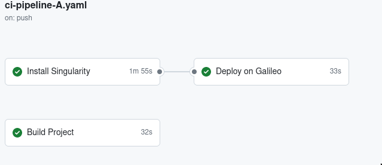
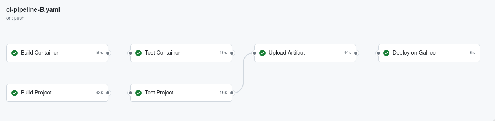

# SE4HPCproject
The second section of the Software Engineering for HPC hands-on projects consists in the definition of a
continuous integration/deployment workflow to automate the build, test, and containerization steps.
Additionally, the introduction of the MPI-based matrix multiplication algorithm required the definition of a job script
to be run on the GALILEO Supercomputer as well as an extension of the previously defined action to target automatic 
execution on the cluster in the case of push to the repository.

## Results
In the root directory of the repository you will be able to find the [shell script](/job.sh) that was run on GALILEO. Workflows are defined 
in the usual directory [/.github/workflows](/.github/workflows), while the log files of the slurm job are present in the [/galileo](/galileo) directory, present
in the root. Finally, the Singularity container is present in the [/container](/container) directory.

## Workflows
We decided to implement two different workflows, in order to explore different approaches to the problem. Both the workflows are triggered by a push event on the main branch and run on the latest version of ubuntu. They build the project and the container in parallel, and then run the tests. Once the tests are completed, the container is deployed to the GALILEO supercomputer.

### Workflow A
The first workflow, [ci-pipeline-A.yml](/.github/workflows/ci-pipeline-A.yaml), is a faster version of the pipeline. It uses the cache action `actions/cache@v2` to speed up the build process and the `Singularity Remote` to upload the container to the GALILEO supercomputer.
The workflow is defined as follows: 



### Workflow B
The second workflow, [ci-pipeline-B.yml](/.github/workflows/ci-pipeline-B.yaml), is a more structured version of the pipeline. It splits the build and test steps into two separate jobs, and uses `scp` to upload the container to the GALILEO supercomputer. Each job produces an *artifact* that is passed to the next job in the pipeline. Even though splitting the jobs increases the overall time of the pipeline, it allows for a more structured and modular approach to the problem, and makes it easier to debug and maintain the pipeline in the future. The workflow is defined as follows:




# SINGULARITY CONTAINER
The [/container](/container) contains two Singularity container definitions used to run the application. The singularity *definition* file is `matrix_multiplication.def`
. To build the container, run the following command:

```bash
sudo singularity build mm.sif matrix_multiplication.def
``` 

The container is built starting from the base image `ubuntu:22.04` and moves the project into the container. The former command creates a compressed read-only Singularity Image File (SIF) named `mm.sif`. In order to build the container with writable root directory, you can specify the option `--sandbox` for interactive development.

To run the container, use the following command:

```bash
singularity run mm.sif
```

To execute the tests, run the following command:

```bash
singularity test mm.sif
```

## Acknowledge
Project work carried out by 
- Edoardo Carrà 11015152
- Lorenzo Gentile 11001962
- Luca Guffanti 10720858
